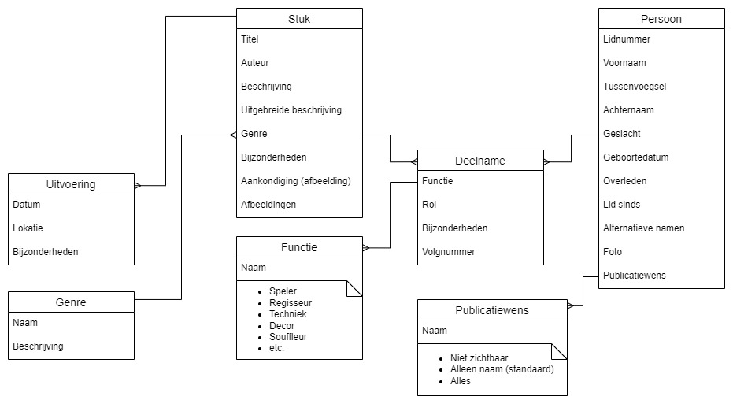

# TAS
Theodulfus Archief Systeem
## Beschrijving
TAS is een digitaal archief van gespeelde (en in sommige gevallen niet gespeeld) stukken. De gegevens zijn gebaseerd op de tekst en informatie op de aankondigingen die verstuurd zijn.
Waar mogelijk is de originele aankondiging als afbeelding opgenomen.
De stukken zijn doorzoekbaar op basis van verschillende velden, bijv. op datum of op persoon.
Het betreft een web-based systeem, zowel beheer als raadplegen vindt plaats in de browser. Op deze manier kan eenvoudig door meerdere personen in het archief gewerkt worden, is het archief eenvoudig te raadplegen en eventueel te integreren en de bestaande theodulfus website.
## Use cases
Om de gewenste functionaliteit af te kaderen en op een non-technische manier te beschrijven, is deze beschreven de volgende use-cases:
#### Beheer
Een beheerder kan...
- een stuk, en de bijbehorende metadata, toevoegen
- een stuk, en de bijbehorende metadata, wijzigen
- een stuk, en de bijbehorende metadata, verwijderen
- bij het toevoegen of wijzigen van een stuk de spelers, regie en crew kiezen uit een lijst van personen
- een persoon (lid/oud lid) aan de lijst van personen toevoegen
- een persoon (lid/oud lid) in de lijst van personen wijzigen
- een persoon (lid/oud lid) uit de lijst van personen verwijderen, mits deze niet aan een stuk is gekoppeld
- bij een persoon specificeren of zijn/haar gegevens (die van vastgelegd in het archief) openbaar mogen worden gemaakt. Nadar te bepalen hoe gedetailleerd dit kan
- bij een persoon een lijst van alternatieve namen beheren zodat omgegaan kan worden met naamswijzigingen bijv. wanneer iemand trouwt
- een of meerder scans van een aankondiging toevoegen
- op basis van eerder toegevoegde scans de metadata van een stuk invullen, ***(nice-to-have)** ondersteund door OCR*

#### Gebruik
Een gebruiker kan...
- de lijst van stukken doorbladeren (bijv. gesorteerd op datum)
- de informatie van een stuk inzien
- de (scan van) de originele aankondiging bekijken
- het archief doorzoeken op titel
- het archief doorzoeken op datum of jaartal
- het archief doorzoeken op persoon (speler, regie of crew, wellicht te specificeren)
## Datamodel
Het datamodel voor de archief-data. Niet opgenomen hierin zijn de datastructuren voor gebruikersbeheer, logging, e.d.

## Documentatie
Om ervoor te zorgen dat dit systeem bruikbaar en te onderhouden is en blijft, wordt de broncode opgeslagen in Github: https://github.com/nvdhulst79/TAS
Het betreft maatwerk code, dus een bepaalde kennis een vaardigheid met programmeren zal vereist zijn om hierin te werken. Om dit zo eenvoudig mogelijk te maken wordt zoveel mogelijk gebruik gemaakt van proven technology en breed ondersteunde platforms.
Algemene documentatie zal zoveel mogelijk in dit document (readme.md) worden bijgehouden, specifieke documentatie als comments in de code. Zo nodig zal er een instructie voor beheerders en/of gebruikers worden opgesteld.

#### Hosting

#### Programmeertalen
- Python
- SQL
#### Framework
- Django
#### Database
- Nader te bepalen
#### Overige componenten
- Nader te bepalen
